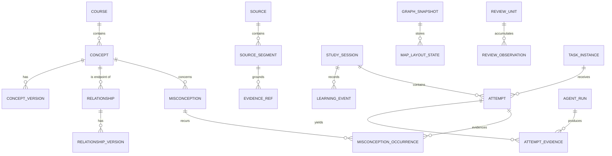
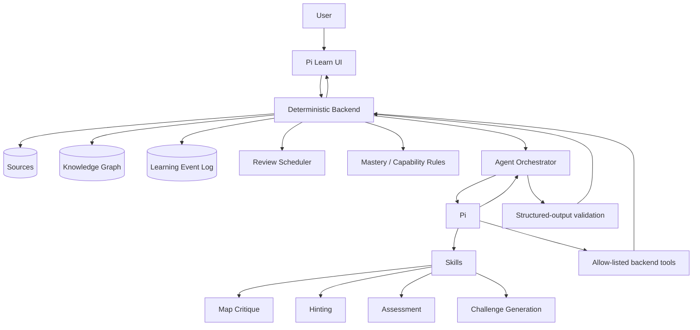
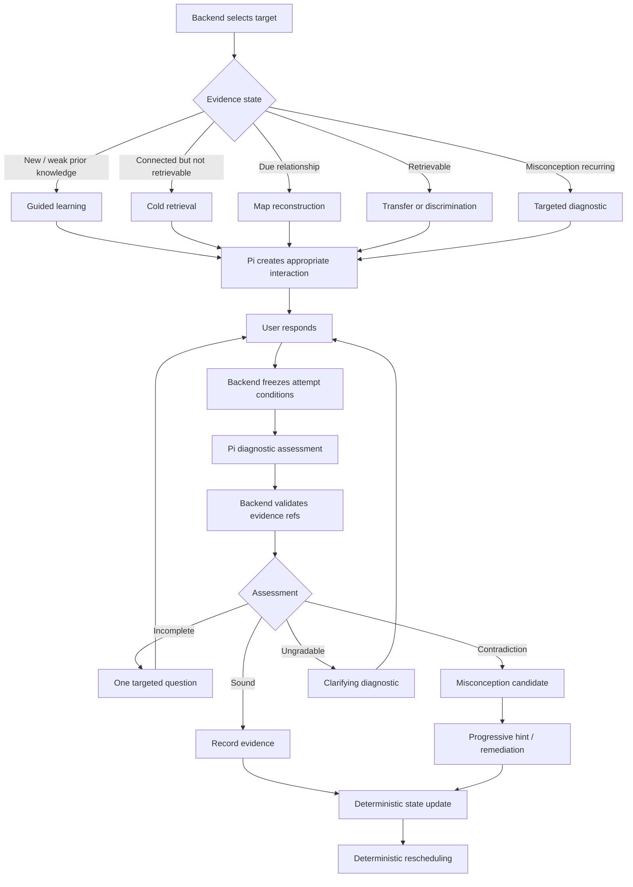

# Pi Learn: A Research-Informed Architecture for Relational Learning, Retrieval, and AI Tutoring

Status: research background / archive.

This file preserves the original long-form research report. It is not the day-to-day implementation contract for Pi agents. For normal coding work, start with `../README.md` and the focused documents it routes to.

## Executive summary

The strongest version of Pi Learn should **not** attempt to reproduce iCanStudy literally, nor should it become an AI tutor that explains everything on demand. The best synthesis is to combine the parts of Justin Sung's approach that are pedagogically compelling—learner-generated organisation, explicit relationships, restructuring information, selective emphasis, interleaving and metacognitive control—with the parts of learning science that have stronger experimental support: retrieval practice, spacing, self-explanation, corrective feedback, concept mapping, worked-example fading and adaptive guidance. iCanStudy itself frames learning through encoding and retrieval and explicitly emphasises higher-order processing, interleaving and spaced retrieval. citeturn19view4turn24view7

The research also provides an important corrective to an overly Sung-like system. Retrieval is not merely something used to prevent decay after good encoding: retrieval practice can itself substantially improve later learning, including conceptual learning. In Karpicke and Blunt's experiments, retrieval practice outperformed elaborative concept mapping under the tested conditions; Roediger and Karpicke likewise demonstrated a durable testing effect. citeturn21search0turn21search1 Concept mapping nevertheless has a substantial evidence base of its own: a meta-analysis of 55 studies and 5,818 learners found generally positive effects on knowledge retention, albeit with considerable heterogeneity depending on how maps were used. citeturn20view4

The right Pi Learn loop is therefore:

> **Orient → construct → explain relationships → close the source → reconstruct → retrieve → discriminate → transfer → space → reconstruct again.**

That is subtly different from both Anki and a conventional AI tutor.

The principal implementation decisions I recommend are:

| Area | Recommendation |
|---|---|
| **Concept maps** | Treat edges as first-class, human-readable propositions rather than generic links. The learner creates the primary structure; Pi critiques it. Maintain separate learner, reference, reconstruction and AI-proposal layers. |
| **AI ownership** | Pi may interpret, diagnose, critique, generate and ask questions. It should **not** own concepts, mastery, schedules, map versions or learning history. |
| **Backend ownership** | Deterministically own the graph, provenance, immutable events, source visibility, assistance level, review queue, capability rules and task difficulty. |
| **LLM assessment** | Split diagnosis from tutoring. Pi first returns structured, evidence-grounded judgements; the backend validates and stores them; only then does Pi formulate pedagogical feedback. |
| **Misconceptions** | Do not equate an omission with a misconception. Require an explicit contradictory student span, or repeated strong evidence, before promoting a misconception candidate. |
| **Hints** | Backend-controlled levels from cold attempt through worked explanation. Pi cannot escalate its own permissions. |
| **Retrieval** | Review **relationships and clusters as well as concepts**. A cold retrieval attempt means source closed, map hidden, no hint and no answer-contaminated context. |
| **Scheduling** | Start with an auditable deterministic scheduler. Move to an FSRS/half-life/MLE-style memory model when enough genuine cold-retrieval observations exist. Do **not** start with reinforcement learning. |
| **Interleaving** | Mix confusable methods that require different decisions, rather than randomly shuffling unrelated material. |
| **Mastery** | Separate *highest capability demonstrated* from *current retrievability*. Never reduce learning to one opaque “82% mastery” number. |
| **Pi integration** | Use the Pi SDK with an allow-listed set of narrow custom tools for V0.1. Disable unnecessary general-purpose tools. Consider RPC/container isolation later. |
| **Product philosophy** | The central artefact is **your developing model of the subject**, not a chat transcript. Pi is the coach beside the artefact. |

A key caveat is warranted. In the searches performed for this report, I did **not** locate a peer-reviewed controlled evaluation of the complete iCanStudy programme as a package. That does not establish that none exists, but it means iCanStudy's branded frameworks should be treated as **design hypotheses informed by theory and practice**, rather than as independently validated interventions. iCanStudy itself says that parts of its approach use custom frameworks and adaptations developed from research and practical experience. citeturn19view4

For Pi Learn, that is actually a useful position: **take Sung seriously, but make the system measurable enough that we can discover which parts genuinely improve your learning.**

## Evidence base and prioritised source review

iCanStudy's public framework is unusually compatible with the product we have been sketching. Its official diagnostic separates **priming, encoding, reference, retrieval, interleaving and overlearning**, while its technical explanation frames effective learning as a combination of encoding quality, retrieval and cognitive-load management. citeturn19view4turn24view7 The strongest design insight from Sung's material is not “make mind maps”; it is that the learner should **reorganise and relate information rather than merely reproduce the source's organisation**.

That distinction matters. A beautiful AI-generated graph can remove exactly the generative work we want from you.

**Justin Sung and iCanStudy sources**

| Source | Concise finding | Relevance to Pi Learn |
|---|---|---|
| [iCanStudy — How do the techniques work?](https://help.icanstudy.com/en/articles/5788956-how-do-the-techniques-work) | Official description frames learning using encoding and retrieval; emphasises cognitive-load regulation, higher-order learning, deep interleaving and spaced retrieval. It also states that iCanStudy uses both evidence-based and custom/adapted frameworks. citeturn19view4 | Treat **encoding and retrieval as separate phases in the state machine**, but do not assume good encoding eliminates the need for observed retrieval evidence. |
| [iCanStudy — Learning Diagnostic](https://quiz.icanstudy.com/learning-diagnostic) | Distinguishes priming, encoding, reference, retrieval, interleaving and overlearning; describes reference notes as a separate function and interleaving as applying knowledge across diverse/curveball situations. citeturn24view7 | Strong argument for distinguishing **conceptual models from reference details**, and for explicit transfer/interleaving modes. |
| [Justin Sung — The Ultimate Guide to the Perfect Mindmap](https://www.youtube.com/watch?v=Grd7K7bJVWg) | Sung's six-step treatment focuses on progressively improving grouping, relationships, interconnectedness, non-verbal representation, direction and emphasis. The published chapters begin at **00:58** for the overall model, then **02:51, 05:22, 08:29, 13:30, 17:09 and 18:47** for the six stages. citeturn18search2 | Directly informs map affordances: groups, labelled/directional edges, cross-cluster links, drawings/formulae and salience. Critically, these should be **learner-created properties**. |
| [Justin Sung — After 10,000 Hours of Studying, I Discovered The Best Learning...](https://www.youtube.com/watch?v=XeKMjwiF3Pc) | Sung's revision-focused treatment centres on interleaving and explicitly frames it as a technique rather than simple repetitive review. The published chapter list starts at **00:00** with his revision-method discussion. citeturn18search1 | Pi Learn should have a distinct **discrimination/interleaving engine**, not merely “random mixed review”. |
| [Justin Sung — How to Learn FASTER using AI (without damaging your brain)](https://www.youtube.com/watch?v=4gQIAXjraLo) | Sung explicitly addresses the tension between AI assistance and doing enough cognitive work oneself; the published chaptering begins at **00:00** with AI's benefits and learning. citeturn18search0 | Supports our “AI friction” principle: AI assistance should be permissioned by the learning state rather than universally maximal. |
| [iCanStudy — What apps does Justin use?](https://help.icanstudy.com/en/articles/5984812-what-apps-does-justin-use) | Sung explicitly argues for building a conceptually sound system first and fitting applications to it rather than designing one's system around app features; the article lists mind-mapping, Anki and PKM tools as replaceable components. citeturn19view5 | This is exactly the right architecture principle for Pi Learn: **pedagogical protocol first, technology second**. |

Two implications follow from these sources.

First, Sung's public material gives us a compelling **representation philosophy**, but we should operationalise vague labels such as “higher-order learning” into things we can actually observe: can the learner explain an edge, reconstruct a structure, discriminate between similar methods, transfer to a new context, and do those things without support?

Second, one iCanStudy claim deserves caution in implementation. Its official explanation argues that stronger encoding can reduce how much retrieval a learner needs. citeturn19view4 That may be a useful practical intuition, but Pi Learn should **never infer reduced review merely because an LLM judges a map to be excellent**. Retrieval itself is a learning event and provides behavioural evidence that a representation is available from memory. citeturn21search0turn21search1

**Core learning-science sources**

| Source | What the evidence says | Pi Learn consequence |
|---|---|---|
| [Roediger & Karpicke — Test-Enhanced Learning](https://pubmed.ncbi.nlm.nih.gov/16507066/) | Taking a memory test can improve later retention rather than merely measure it. citeturn21search0turn21search20 | Retrieval must be a **first-class learning activity**, not just an assessment screen. |
| [Karpicke & Blunt — Retrieval Practice Produces More Learning than Elaborative Studying with Concept Mapping](https://pubmed.ncbi.nlm.nih.gov/21252317/) | In their experiments with educational texts, retrieval practice produced larger gains than the tested concept-mapping condition, including meaningful-learning measures. citeturn21search1 | Do not let source-visible mapping become the endpoint. Follow it with **source-closed reconstruction**. |
| [Nesbit & Adesope — Learning With Concept and Knowledge Maps: A Meta-Analysis](https://journals.sagepub.com/doi/10.3102/00346543076003413) | Across 55 studies and 5,818 participants, node-link mapping was generally associated with improved retention, with substantial heterogeneity by task and comparison condition. citeturn20view4 | Maps are justified, but **how they are constructed matters**. We should test our map protocol rather than assuming any graph is beneficial. |
| [Cepeda et al. — Spacing Effects in Learning](https://pubmed.ncbi.nlm.nih.gov/19076480/) | In a study with more than 1,350 participants and final delays extending to a year, the optimal inter-study gap increased as the desired retention interval increased. citeturn20view2 | Scheduling should eventually be **retention-horizon aware**, especially when exam dates are known. |
| [Taylor & Rohrer — The Effect of Interleaving Practice](https://digitalcommons.usf.edu/psy_facpub/1760/) | With spacing controlled, interleaving four maths problem types hurt practice performance but doubled next-day test scores in their experiment; error analysis suggested better selection of the appropriate procedure. citeturn20view3 | Interleaving should particularly train **“which method applies?” discrimination**, not simply variety. |
| [Chi et al. — Eliciting Self-Explanations Improves Understanding](https://onlinelibrary.wiley.com/doi/10.1207/s15516709cog1803_3) | Explicitly elicited self-explanation facilitated integration of declarative information in the study. citeturn21search14 | Teach-back and “why does this edge exist?” are legitimate learning activities, not only assessment. |
| [Atkinson, Renkl & Merrill — Fading Worked-Out Steps and Self-Explanation](https://asu.elsevierpure.com/en/publications/transitioning-from-studying-examples-to-solving-problems-effects-/) | Across two experiments, combining fading worked steps with prompts about underlying principles improved near and far transfer relative to comparison procedures. citeturn20view6 | Guidance should **fade as competence increases**, and hints should focus on principles rather than immediately revealing answers. |
| [Kalyuga et al. — Expertise Reversal Effect](https://www.researchgate.net/publication/48829036_The_Expertise_Reversal_Effect) | Instructional guidance useful to inexperienced learners can become redundant or counterproductive as expertise rises. citeturn20view7 | Pi should not use one tutoring style. Prior evidence must change how much explanation it provides. |
| [Kang, McDermott & Roediger — Test Format and Corrective Feedback](https://profiles.wustl.edu/en/publications/test-format-and-corrective-feedback-modify-the-effect-of-testing-/) | Their experiments investigated retrieval format and corrective feedback and show that feedback conditions materially affect later retention. citeturn21search23 | Cold attempt **before** feedback; corrective feedback afterwards. Never contaminate the attempt first. |

These findings suggest a particularly strong synthesis for Pi Learn:

**Source-visible mapping is primarily an encoding activity. Source-hidden map reconstruction is primarily a retrieval activity. Teach-back generates and exposes relationships. Interleaved transfer tests whether those relationships can guide decisions.**

That gives us a principled place for Sung's mapping ideas without placing mapping in competition with retrieval.

**Engineering and adaptive-learning sources**

| Source | Engineering lesson | Pi Learn use |
|---|---|---|
| [SuperMemo SM-2](https://super-memory.com/english/ol/sm2.htm) | Classic SM-2 uses per-item easiness factors and expanding intervals based on learner ratings. citeturn22view4 | Useful V0 baseline, but its “smallest possible item” framing is poorly matched to relational knowledge. |
| [Anki FSRS documentation](https://docs.ankiweb.net/deck-options.html) | Modern Anki supports FSRS as an alternative to legacy SM-2 and describes it as modelling forgetting more accurately to increase efficiency. citeturn22view3 | Strong candidate for later review timing if Pi Learn maps richer events onto well-defined review units. |
| [FSRS4Anki](https://github.com/open-spaced-repetition/fsrs4anki) | FSRS separates a scheduler from an optimiser that learns parameters from review history. citeturn22view5 | Excellent architectural precedent: **collect clean observations first; optimise later**. |
| [Duolingo Half-Life Regression](https://github.com/duolingo/halflife-regression) | Duolingo released code/data for a trainable spaced-repetition model based on estimated memory half-life. citeturn22view6 | Good model for a custom Pi Learn MLE/half-life scheduler once enough cold-recall data exist. |
| [Tabibian et al. — Enhancing Human Learning via Spaced Repetition Optimisation](https://pmc.ncbi.nlm.nih.gov/articles/PMC6410796/) | Formulates review scheduling as an optimal-control problem and derives schedules from estimated recall probability and review cost. citeturn22view7 | Shows where Pi Learn could ultimately go, but this complexity is unnecessary at V0.1. |
| [Clément et al. — Multi-Armed Bandits for Intelligent Tutoring Systems](https://jedm.educationaldatamining.org/index.php/JEDM/article/view/JEDM111) | Uses adaptive selection of learning activities based on estimated learning progress and learner constraints. citeturn23search1 | More promising for **choosing task type** than for basic spacing. |
| [Bassen et al. — Reinforcement Learning for Adaptive Scheduling](https://dl.acm.org/doi/10.1145/3313831.3376518) | Demonstrates real-time RL scheduling of educational activities in a large online course. citeturn23search0turn23search25 | A future research direction only after Pi Learn has enough trajectories to evaluate policies safely. |
| [React Flow](https://reactflow.dev/) | MIT-licensed React node-editor library with built-in dragging, zooming, panning, selection and custom nodes/edges. citeturn24view0 | Best fit for a V0.1 user-authored concept-map editor. |
| [Cytoscape.js](https://js.cytoscape.org/) | Provides interactive graph visualisation plus substantial headless graph-analysis functionality in Node.js. citeturn24view1 | Useful later for graph metrics, neighbourhood queries and structural comparison. |
| [Pi SDK](https://pi.dev/docs/latest/sdk) | Pi can be embedded directly into a Node/Bun process with host control over models, sessions, resource loading and active/custom tools. citeturn19view6 | Matches the deterministic-backend/semantic-agent split almost exactly. |
| [Pi Skills](https://pi.dev/docs/latest/skills) | Skills provide specialised instructions and supporting resources loaded when relevant rather than executable application logic. citeturn24view3 | Critique, assessment, hinting and challenge generation belong naturally in separate Skills. |

## Concept maps and the learner data model

The central design decision should be to stop thinking of “the concept map” as one graph.

Pi Learn should maintain **four logically distinct graph layers**:

| Layer | Owner | Purpose | Visible when |
|---|---|---|---|
| **Learner graph** | You | Your present organisation of the subject | Normal study |
| **Reference graph** | Backend/course model | Source-grounded critical propositions, prerequisites and acceptable relationships | Normally hidden |
| **Reconstruction graph** | You | A cold retrieval attempt created without source/reference visibility | Reconstruction sessions |
| **Proposal overlay** | Pi | Suggested relationships, missing concepts or critique targets | Ghosted until accepted |

This prevents one of the most damaging possible design mistakes: letting the “correct AI graph” silently become the object you study.

The learner graph is the learning artefact. The reference graph is an **assessment instrument**.

This also maps well onto Sung's approach. His mind-map material stresses grouping, relationships, cross-connections, direction and emphasis, while his broader iCanStudy framing emphasises learner processing rather than merely storing information. citeturn18search2turn19view4 Concept-map research likewise supports node-link representations but shows enough heterogeneity that the construction procedure should itself be considered part of the intervention. citeturn20view4

**Node design**

Do not create twenty ontology classes in V0.1. A rigid ontology risks turning learning into form-filling. I recommend one stable `concept` identity with a modest `kind` field:

| `kind` | Example |
|---|---|
| `concept` | likelihood |
| `principle` | independence |
| `procedure` | maximum-likelihood estimation |
| `representation` | log-likelihood |
| `problem_family` | parameter-estimation problem |
| `example` | Bernoulli MLE example |
| `reference_detail` | a regularity condition or notation convention |

The last type should normally remain visually collapsed. This implements the useful iCanStudy distinction between **conceptual encoding and reference information** rather than forcing all details into the conceptual map. citeturn24view7

Each node should additionally carry `scope`. This matters enormously in mathematics and statistics. “Likelihood”, for example, may have a course-specific explanation or notation. Pi should not silently universalise one professor's convention.

**Edge design**

Edges are more important than nodes for Pi Learn.

Do not allow this as the final state:

```text
Likelihood ───────── MLE
```

The stored semantic unit should instead be something like:

```text
MLE
  --[selects the parameter value that maximises]-->
Likelihood
```

or:

```text
Independence
  --[allows the joint likelihood to factorise into]-->
Product of individual likelihood terms
```

The **proposition text** is authoritative. `relation_type` exists for filtering and algorithms.

A deliberately small starting taxonomy is sufficient:

| Relation type | Intended semantics |
|---|---|
| `is_a` | taxonomic |
| `part_of` | composition |
| `requires` | prerequisite |
| `enables` | makes a step/process possible |
| `causes_or_influences` | causal/mechanistic |
| `derived_from` | derivational |
| `transforms_to` | procedural transformation |
| `applies_to` | applicability |
| `contrasts_with` | discriminative distinction |
| `analogous_to` | structural analogy |

Every relationship should also require a readable `proposition_text`, direction, optional conditions and source provenance. “Related to” should be allowed only as a temporary draft state.

This directly operationalises the **relational and directional** features in Sung's mind-mapping approach without pretending that his exact visual conventions are scientifically mandatory. citeturn18search2

**Visual grouping should not automatically become ontology.** A cluster you draw around “estimation methods” may be a temporary thinking device. Store groups in `map_group` or layout state separately from semantic edges. That lets you regroup information during learning without rewriting what the concepts objectively mean.

**Recommended core schema**

```text
concepts
──────────────────────────────────────────────
id                    UUID PK
course_id             FK
kind                  enum
canonical_label       text
status                active | merged | archived
created_by            user | import | pi_proposal
current_version_id    FK
created_at            timestamp

concept_versions
──────────────────────────────────────────────
id                    UUID PK
concept_id            FK
title                 text
user_definition       text nullable
scope                 text nullable
importance            smallint nullable
visual_anchor_id      FK nullable
supersedes_id         FK nullable
created_at            timestamp
```

```text
relationships
──────────────────────────────────────────────
id                    UUID PK
course_id             FK
source_concept_id     FK
target_concept_id     FK
relation_type         enum
status                draft | confirmed | rejected
created_by            user | import | pi_proposal
current_version_id    FK
created_at            timestamp

relationship_versions
──────────────────────────────────────────────
id                    UUID PK
relationship_id       FK
proposition_text      text
conditions            json nullable
importance            smallint nullable
supersedes_id         FK nullable
created_at            timestamp
```

Provenance belongs in a join table rather than being stuffed into the edge:

```text
evidence_refs
──────────────────────────────────────────────
id                    UUID PK
entity_type           concept | relationship | rubric_claim
entity_id              UUID
source_segment_id      FK
support_type           supports | contradicts | contextualises
created_by             user | pi | import
verified               boolean
```

The learning history should be **append-only**:

```text
learning_events
──────────────────────────────────────────────
id                    UUID PK
user_id               FK
course_id             FK
session_id            FK
event_type            text
target_type           concept | relationship | cluster | misconception
target_id             UUID
occurred_at           timestamp

source_visible        boolean
assistance_level      0..5
task_instance_id      FK nullable

payload_json          json
```

That one table should record events such as:

```text
attempt_started
source_opened
map_edge_created
map_edge_changed
hint_requested
response_submitted
assessment_completed
misconception_observed
misconception_corrected
reconstruction_submitted
review_scheduled
```

Crucially, `source_opened` and `hint_requested` are not trivial analytics events. They determine whether an attempt can legitimately count as cold retrieval.

Misconceptions deserve a separate lifecycle:

```text
misconceptions
──────────────────────────────────────────────
id                    UUID PK
course_id             FK
concept_id            FK nullable
canonical_statement   text
contradicts_claim_id  FK nullable
severity              minor | material | critical
state                 candidate | confirmed | resolved | recurring
first_seen_at         timestamp
last_seen_at          timestamp
resolved_at           timestamp nullable

misconception_occurrences
──────────────────────────────────────────────
id                    UUID PK
misconception_id      FK
attempt_id            FK
student_span_start    integer
student_span_end      integer
student_text          text
assessor_confidence   float
human_verified        boolean nullable
occurred_at           timestamp
```

An **omission is not a misconception**. If you explain MLE but fail to mention independence, that is `missing_critical_claim`. If you say, “likelihood is the probability distribution of theta given the data”, that may constitute an explicit misconception. This distinction is particularly important because automated short-answer grading remains imperfect: general-purpose GPT-4 was competitive with older engineered systems but behind specialised models in one benchmark study, and LLM feedback can introduce unsupported assertions. citeturn22view1turn22view0

Supporting tables should include:

| Table | Purpose |
|---|---|
| `source_segments` | Immutable chunks/page anchors for evidence grounding |
| `study_sessions` | Session/mode/course boundaries |
| `task_templates` | Deterministic task definitions |
| `task_instances` | Generated prompt and difficulty configuration |
| `attempts` | Learner responses and attempt conditions |
| `attempt_evidence` | Proposition-level LLM assessment |
| `review_units` | Schedulable concept/relationship/cluster/misconception |
| `review_observations` | Cold-retrieval outcomes used by scheduler |
| `graph_snapshots` | Immutable map/reconstruction versions |
| `map_layout_state` | Position, grouping, collapsed state and visual emphasis |
| `agent_runs` | Prompt/skill/model versions, input hashes and structured outputs |

**Versioning should be immutable, not “save over the old graph”.**

A graph snapshot should record:

```text
snapshot_id
map_id
purpose:
  learner
  reconstruction
  reference

session_id
based_on_snapshot_id
created_at
```

It then references the active concept/relationship versions and layout state.

That unlocks a genuinely interesting learning feature:

```text
September 15:
  Your MLE model had 5 nodes and 4 edges.

September 29:
  8 nodes and 10 edges.
  Three new cross-lecture connections appeared.

October 10 cold reconstruction:
  7/8 important concepts recovered.
  But the independence → factorisation edge disappeared.
```

Pi can reason about that history, while the **backend establishes the facts deterministically**.

The entity model can be represented as:



The UI implication is equally important: Pi proposals should appear as **ghost objects**.

```text
solid node/edge       = yours and committed
dashed/ghost edge     = Pi proposal
warning badge         = Pi critique
source icon           = evidence attached
clock icon            = retrieval due
red recurrence marker = misconception has reappeared
```

Clicking a ghost edge should offer:

```text
Why did Pi suggest this?
Try to explain it myself
Show source evidence
Accept relationship
Reject relationship
```

Do **not** have an “AI organise my whole lecture” button in the primary workflow.

## Pi agent workflows, teach-back and progressive assistance

The fundamental AI architecture should be **assessment first, pedagogy second**.

A naïve tutor makes one model call:

```text
student answer
     ↓
LLM
     ↓
"Great job! Here's what you missed..."
```

That conflates diagnosis, grading, domain recall and teaching.

Pi Learn should instead do:

```text
student response
      │
      ▼
deterministic context builder
      │
      ├── relevant source segments
      ├── expected propositions
      ├── known misconception catalogue
      ├── task rubric
      ├── current assistance level
      └── learner-history subset
      │
      ▼
PI: DIAGNOSTIC PASS
      │
      ▼
structured evidence
      │
      ▼
backend validation
      │
      ▼
PI: COACHING PASS
      │
      ▼
one pedagogical intervention
```

This separation is justified partly by what current LLM educational research does **not** guarantee. One EDM study found substantial unsupported material in automatically generated feedback—23.5% in the prompt-driven system it studied—and even its best tested automatic hallucination detector only partially aligned with human judgement. citeturn22view0 Another study found general-purpose GPT-4 useful for short-answer grading but weaker than specialised trained systems on established grading benchmarks. citeturn22view1 Research on identifying misconceptions in self-explanations likewise suggests that LLMs can perform the task, but quality varies by prompting/model and specialised training can improve it. citeturn22view2

Therefore the LLM should never be permitted to say merely:

```json
{
  "mastery": 0.78
}
```

It should be forced to show **what in the learner response caused each judgement**.

A good proposition-level assessment record looks like:

```json
{
  "claim_id": "mle-likelihood-03",
  "status": "contradicted",
  "student_span": "likelihood is the probability of theta given the data",
  "student_span_start": 84,
  "student_span_end": 139,
  "evidence_refs": ["lecture05:p8:s3", "textbook:4.2:p2"],
  "confidence": 0.94,
  "misconception_candidate": "LIKELIHOOD_AS_POSTERIOR"
}
```

By contrast:

```json
{
  "claim_id": "mle-independence-02",
  "status": "not_addressed",
  "misconception_candidate": null
}
```

That single distinction will prevent a lot of bogus tutoring.

**Recommended assessment rubric**

Rather than asking the model to invent a holistic grade, every task has an explicit set of required propositions and dimensions.

| Dimension | What Pi judges | Backend interpretation |
|---|---|---|
| **Accuracy** | Is an expressed proposition supported, contradicted or ambiguous? | Critical contradictions can fail the task |
| **Coverage** | Which required propositions were addressed? | Omission ≠ misconception |
| **Relational precision** | Does the learner state *how/why* A relates to B? | Needed for `CONNECTED` |
| **Mechanistic reasoning** | Is an underlying rule/assumption identified? | Stronger evidence than name recognition |
| **Discrimination** | Can learner distinguish nearby alternatives? | Used in interleaving |
| **Transfer** | Is knowledge used correctly in an unfamiliar representation/context? | Needed for `TRANSFERABLE` |
| **Independence** | What assistance/source exposure occurred? | Stored separately from content quality |

Do not fold the final row into “knowledge quality”. A perfect answer after a level-four hint and a perfect cold answer are both correct responses but provide very different evidence about retrievability.

A deterministic band can then be computed:

```text
SOUND
all critical propositions correct
AND no critical contradiction

INCOMPLETE
no critical contradiction
BUT >= 1 required proposition missing/ambiguous

UNSOUND
>= 1 critical proposition contradicted

UNGRADABLE
evidence pack or learner response insufficient
```

Optional subtler rubrics can sit underneath those bands, but the application should generally show the **specific evidence**, not an arbitrary 87%.

**Pi Skill: `map-critic`**

Pi Skills are appropriate for these instruction-heavy workflows: current Pi documentation describes Skills as specialised instruction bundles that can include supporting references/assets and are loaded when relevant. citeturn24view3

```text
---
name: map-critic
description: Critiques a learner-created concept map without replacing
             the learner's structure. Use after a learner adds, edits,
             or submits a map or reconstruction.
---

ROLE
You are a learning coach assessing the learner's model.

PRIMARY RULE
The learner must do the organisational work.
Do not redraw the map or provide a complete corrected map.

INPUTS
- LEARNER_SUBGRAPH
- REFERENCE_PROPOSITIONS
- SOURCE_EVIDENCE
- PRIOR_EVIDENCE
- ASSISTANCE_LEVEL

ASSESSMENT
For each relevant learner relationship:
1. Determine whether its proposition is:
   supported / partially_supported / contradicted / ambiguous.
2. Cite evidence IDs.
3. Identify the single highest-value gap or imprecision.
4. Distinguish omission from misconception.
5. If evidence is insufficient, say so.

COACHING
Select ONE:
- ask learner to clarify an edge;
- ask learner to compare two edges;
- point learner towards an unconnected region;
- ask learner to reconsider direction;
- ask learner to identify the assumption behind an edge.

Do not disclose a missing relationship unless the current
assistance level permits it.

OUTPUT
Structured JSON only.
```

The user-facing coaching sentence should be generated only from the accepted diagnostic output.

For example:

> **Pi:** “You have connected independence to likelihood. I understand *that* you think they are related, but your edge doesn't yet say what independence lets you do. Can you make the relationship into a sentence?”

That is much better than:

> “Change it to: independence allows the joint density to factor into a product.”

The second version is a useful hint later. It is a bad first critique.

**Pi Skill: `hint-controller`**

Worked-example fading and the expertise-reversal literature strongly support adapting guidance to the learner's prior competence rather than always maximising or minimising help. citeturn20view6turn20view7

The backend should expose an immutable assistance permission:

| Level | Pi is allowed to do | Pi must not do |
|---:|---|---|
| **0** | Ask learner to attempt/reconsider | Reveal relevant concept or operation |
| **1** | Metacognitive cue | Name the answer-producing rule |
| **2** | Point towards relevant concept/relationship | Give the needed operation/result |
| **3** | Name specific principle/rule | Complete the step |
| **4** | Show one partial worked step | Finish the solution |
| **5** | Full explanation/worked solution | — |

Example:

```text
Question:
Why does taking log L(theta) not change the MLE?

Level 1
"What property does the optimisation step need to preserve?"

Level 2
"Think about what a strictly increasing transformation does
to the ordering of candidate values."

Level 3
"The relevant property is monotonicity of log."

Level 4
"If L(theta_1) > L(theta_2), then
log L(theta_1) > log L(theta_2).
What does that imply about the argmax?"

Level 5
Full explanation and derivation.
```

The Skill:

```text
---
name: hint-controller
description: Generates exactly one hint whose information content
             does not exceed a backend-specified assistance level.
---

You receive:
- TASK
- LEARNER_ATTEMPT
- ALLOWED_LEVEL
- SOURCE_EVIDENCE
- PRIOR_HINTS

Hard constraints:
- Never exceed ALLOWED_LEVEL.
- Never repeat a prior hint verbatim.
- Do not provide later-step information early.
- At levels 1-3, do not give the final result.
- Ground domain claims only in SOURCE_EVIDENCE.
- Return one hint, not a mini-lesson.

Also return privately:
{
  "level_used": ...,
  "answer_leak_risk": "low|medium|high",
  "evidence_refs": [...]
}
```

For high-value tasks, V1 should run a second **hint-leakage verifier** before displaying the hint.

**Pi Skill: `teachback-assessor`**

Self-explanation has substantial experimental support as a generative learning activity. citeturn21search14turn20view6 Pi gives us something older tutoring systems struggled with: interpreting an unconstrained explanation semantically.

But the model should not compare prose by word overlap.

The reference representation should instead be a set of propositions:

```text
MLE-01:
observed data are treated as fixed when evaluating likelihood

MLE-02:
likelihood is evaluated as a function of the parameter

MLE-03:
under the stated independence assumptions,
joint likelihood factorises

MLE-04:
MLE selects a maximiser of the likelihood

MLE-05:
strictly monotonic log transformation preserves the argmax
```

Then the assessment prompt becomes:

```text
---
name: teachback-assessor
description: Evaluates a learner's free-form explanation against
             source-grounded propositions and known misconceptions.
---

Do not write feedback yet.

For every EXPECTED_PROPOSITION, label:
- entailed
- partially_entailed
- contradicted
- not_addressed
- ambiguous

For every non-"not_addressed" judgement:
quote the minimal learner span that supports the judgement.

MISCONCEPTION RULE
A missing idea is not a misconception.
Only flag a misconception when the learner explicitly states
or strongly entails a contradictory proposition.

Do not infer mental state from writing style.

If the explanation could be interpreted two ways:
return "ambiguous" and propose ONE discriminating follow-up question.

All domain judgements require SOURCE_EVIDENCE ids.

OUTPUT:
{
  "propositions": [...],
  "misconception_candidates": [...],
  "follow_up": null | {...},
  "ungradable_reasons": []
}
```

This makes the teach-back itself richer than “Pi gives it 7/10”.

The UI can instead show:

```text
YOUR EXPLANATION OF MLE

✓  Likelihood is treated as a function of θ
✓  Maximisation selects an estimate
?  Independence was not discussed

!  Possible misconception:
   "probability of theta given the observations"

   Pi is not yet certain this is what you meant.

   Follow-up:
   "When writing L(θ | x), which quantity is being varied?"
```

A strong follow-up is often better than immediately “correcting” an ambiguous sentence.

**Pi Skill: `challenge-generator`**

Task generation should be constrained by a deterministic **difficulty vector**:

```json
{
  "target_concepts": ["MLE", "MAP"],
  "task_family": "discrimination",
  "cue_explicitness": 0,
  "context_novelty": 2,
  "representation_shift": 1,
  "integration_count": 2,
  "distractor_similarity": 2,
  "max_steps": 4,
  "forbidden_terms": ["maximum likelihood", "MAP"],
  "assessment_goal": "identify which inferential method applies"
}
```

Pi then generates the surface form:

```text
---
name: challenge-generator
description: Generates source-grounded retrieval, discrimination
             and transfer tasks to backend-specified constraints.
---

Use only SOURCE_EVIDENCE for assessable domain content.

TASK must satisfy DIFFICULTY_VECTOR.

Do not reveal target-concept names when cue_explicitness = 0.

Return:
1. learner-facing task;
2. hidden expected propositions;
3. hidden solution outline;
4. source evidence for each expected proposition;
5. reasons the task satisfies each requested difficulty dimension;
6. ambiguity risks.

Do not mark the learner response.
```

V1 should add a separate `challenge-verifier` pass. The generator should not be allowed to declare its own question unambiguous without independent review.

## Retrieval, spacing, interleaving and mastery algorithms

The retrieval engine should schedule **knowledge units**, not just flashcards.

A `review_unit` may target:

```text
CONCEPT
"Explain likelihood."

RELATIONSHIP
"Why does independence lead to a product here?"

CLUSTER
"Reconstruct the chain from sample → parameter estimate."

MISCONCEPTION
"Is likelihood P(theta | x)? Explain."

DISCRIMINATION_SET
"MLE vs MAP vs method of moments."

PROCEDURE
"Reconstruct the derivation."

TRANSFER_SCHEMA
"Recognise estimation in an unfamiliar problem."
```

This is a major advantage over importing Anki wholesale.

Retrieval practice has strong support as a learning mechanism, while spacing research shows that timing interacts with the desired retention horizon. citeturn21search0turn20view2 Pi Learn should therefore distinguish **what needs to be retrieved** from **when it needs to be retrieved**.

**Cold retrieval must have a strict machine-readable definition:**

```text
cold_retrieval =
    source_visible == false
    AND reference_graph_visible == false
    AND answer_shown == false
    AND max_assistance_level == 0
    AND response_submitted_before_feedback == true
```

If you open the lecture halfway through:

```text
cold_retrieval = false
```

The attempt remains useful. It simply becomes an open-book learning event.

Similarly:

```text
hint → correct answer
```

should never be recorded as a successful cold recall.

That anti-self-deception property may turn out to be one of Pi Learn's most valuable features.

**Retrieval task ladder**

| Task | Main evidence generated | Typical stage |
|---|---|---|
| Free recall / brain dump | availability of core ideas | Retrievable |
| Relationship explanation | relational understanding | Connected |
| Map reconstruction | organisation + retrieval | Connected/Retrievable |
| Derivation reconstruction | procedural and conceptual chain | Retrievable |
| Example generation | schema flexibility | Connected/Transfer |
| Contrast question | discrimination | Transferable |
| Unlabelled mixed problem | method selection | Transferable |
| Representation shift | transfer across forms | Transferable |
| Counterexample / boundary case | depth and limitation awareness | Transferable/Fluent |

Interleaving should be purposeful. Taylor and Rohrer's results are especially interesting because spacing was controlled, and the benefit appeared related to choosing the appropriate procedure. citeturn20view3 Thus, an ideal interleaved set is:

```text
same-looking cue
      │
      ├── requires MLE
      ├── requires MAP
      └── requires method of moments
```

rather than:

```text
MLE
linear algebra
French vocabulary
binary trees
```

The backend can derive **confusion sets** from:

```text
CONTRASTS_WITH edges
shared prerequisite
shared surface cue
same problem_family
historically confused concepts
misconception co-occurrence
```

Pi then generates actual examples inside those constraints.

**Assistance-state algorithm**

Pi must never control the assistance state itself:

```text
function requestHint(attempt):
    assert attempt.status == "active"

    nextLevel = min(attempt.assistanceLevel + 1, 5)

    appendEvent(
        type = "hint_requested",
        assistanceLevel = nextLevel
    )

    attempt.assistanceLevel = nextLevel

    return callPiHintSkill(
        allowedLevel = nextLevel,
        attempt = attempt
    )
```

Opening the source has an equally deterministic effect:

```text
function sourceOpened(attempt):
    attempt.sourceVisible = true
    attempt.qualifiesAsCold = false

    appendEvent(type = "source_opened")
```

A correct answer after support produces:

```text
content_result = SOUND
independence = ASSISTED
```

rather than:

```text
mastered = true
```

After level-five explanation, the item should normally receive a later cold retest. Immediate reproduction after being shown the answer is weak evidence of durable retrieval.

**V0.1 scheduling algorithm**

For the initial single-user system, I favour an intentionally boring algorithm because we need **clean learning data before clever optimisation**.

A configurable default interval ladder might be:

```text
1d → 3d → 7d → 14d → 30d → 60d
```

Those exact values are a product hypothesis, not a uniquely research-prescribed sequence. Spacing research instead tells us that expanding gaps are broadly sensible and that appropriate gaps depend on the desired retention horizon. citeturn20view2

Pseudocode:

```text
INTERVALS = [1, 3, 7, 14, 30, 60]

function processReview(unit, attempt):

    record(attempt)

    cold =
        !attempt.sourceVisible &&
        attempt.maxAssistanceLevel == 0 &&
        !attempt.answerPreviouslyRevealed

    if attempt.hasCriticalMisconception:
        unit.stage = max(0, unit.stage - 2)
        unit.dueAt = tomorrow()
        return

    if cold && attempt.band == SOUND:
        unit.stage = min(unit.stage + 1, INTERVALS.lastIndex)
        unit.dueAt = now + INTERVALS[unit.stage]
        return

    if cold && attempt.band in [INCOMPLETE, UNSOUND]:
        unit.stage = max(0, unit.stage - 1)
        unit.dueAt = tomorrow()
        return

    # Assisted success = useful remediation, not proof of retrieval.
    if !cold && attempt.band == SOUND:
        unit.dueAt = min(unit.dueAt, tomorrow())
```

For a semester course with a known assessment date, the backend should additionally constrain schedules so relevant material receives retrieval opportunities before the required retention horizon. Cepeda et al.'s result is a strong reason to make assessment horizon an explicit scheduler input rather than assume the same interval policy for “exam tomorrow” and “need this next year”. citeturn20view2

**V1 MLE-style memory model**

Once enough genuine cold attempts exist, we can model recall probability rather than advancing through a fixed ladder.

A clean half-life formulation is:

\[
P(\text{recall at }t)=2^{-t/h}
\]

where \(h\) is estimated memory half-life.

We then model:

\[
\log h = \theta^\top x
\]

with features such as:

```text
prior cold successes
prior failures
task family
concept / relationship class
time since previous retrieval
historical difficulty
transfer vs direct retrieval
misconception recurrence
```

Fit \(\theta\) by regularised maximum likelihood over **cold binary recall observations**:

\[
\theta^\* =
\arg\max_\theta
\sum_i
\left[
y_i \log p_i +(1-y_i)\log(1-p_i)
\right]
-\lambda\|\theta\|^2.
\]

Then for a desired recall threshold \(\tau\):

\[
t_{\text{next}}
=
-h\log_2(\tau).
\]

This is not a claim that this exact model is “the scientifically correct memory model”; it is a practical Pi Learn design inspired by trainable half-life approaches such as Duolingo's HLR. Duolingo's public implementation explicitly accompanies its trainable spaced-repetition model. citeturn22view6

The important point is architectural: **assisted successes should not silently become positive recall labels**.

An assisted event can be a feature describing relearning. It should not be the target observation “remembered unaided”.

**Scheduler comparison**

| Approach | Main idea | Data requirement | Strengths | Problems for Pi Learn | Recommendation |
|---|---|---:|---|---|---|
| **SM-2** | Rule-based interval growth + easiness factor | Very low | Simple, inspectable, proven practical history | Designed around atomised items and self-ratings; weak relational model citeturn22view4 | Useful baseline only |
| **FSRS** | Learned memory-state model and optimiser | Moderate | Modern, open implementation; personalises using review history citeturn22view3turn22view5 | Pi Learn events/tasks are richer than conventional cards | Strong V1 baseline |
| **Half-life / MLE model** | Estimate recall-decay parameters from outcomes | Moderate–high | Interpretable probability, feature-rich, naturally supports custom Pi Learn events | Cold start and sparse concept-specific observations | **My preferred custom V1 research direction** |
| **Optimal-control scheduling** | Optimise recall probability under review cost | High | Principled objective; MEMORIZE has empirical large-scale evidence citeturn22view7 | More machinery than early product needs; objective specification matters | Later experiment |
| **Contextual bandit** | Pick activity with highest estimated learning progress/reward | High | Natural for adaptive task selection citeturn23search1 | Requires exploration; credit assignment difficult | Potential V2 selector |
| **Full RL** | Learn multi-step pedagogical policy | Very high | Can optimise sequences rather than isolated choices; demonstrated in online education research citeturn23search0 | Data-hungry, hard to debug, unsafe exploration can reduce learning | **Do not use in V0.1/V1.0** |

The key architectural distinction is:

> **Memory scheduling and pedagogical action selection are different optimisation problems.**

FSRS/MLE-like methods answer:

> “When should this relationship be retrieved again?”

A future contextual bandit could answer:

> “Given that MLE is due, should today's activity be a teach-back, map reconstruction, derivation, contrast problem or transfer problem?”

Do not use an RL hammer for both.

**Difficulty calibration**

Store task difficulty as an explicit vector rather than a single LLM adjective like `hard`:

```text
cue_explicitness       0–3
context_novelty        0–3
representation_shift   0–2
integration_count      1–4
distractor_similarity  0–3
procedural_depth       0–3
time_pressure          off/on
```

Then use a deterministic staircase:

```text
two sound independent attempts
    → increase one difficulty dimension

one failure
    → keep difficulty, change surface context

repeated failure
    → lower one dimension or enter guided remediation

assisted success
    → do not increase difficulty

critical misconception
    → target misconception before difficulty progression
```

The initial transition rules are product hypotheses and should be calibrated empirically. The research supports adapting guidance to competence, but it does not hand us one universal numerical staircase. citeturn20view6turn20view7

**Mastery rules**

I recommend eliminating a single mutable `mastery` variable.

Store two separate concepts:

```text
CAPABILITY
highest level behaviourally demonstrated

CURRENT RETRIEVABILITY
estimated likelihood that relevant knowledge
can be retrieved now
```

Capability can use this state machine:

| State | Minimum evidence |
|---|---|
| `UNKNOWN` | No useful evidence |
| `BUILDING` | Can respond correctly with guidance/source |
| `CONNECTED` | Can accurately explain required core relationships |
| `RETRIEVABLE` | Repeated source-hidden, no-hint retrieval across separate sessions |
| `TRANSFERABLE` | Correct application in novel/unlabelled contexts and at least one discrimination task |
| `FLUENT` | Repeated independent retrieval and transfer over meaningful delay and varied task types |

For a semester-scale V0.1, I would make “repeated” configurable rather than bury it in Pi. A reasonable initial product rule might require at least two successful cold observations on separate days before `RETRIEVABLE`, and require later delayed/transfer evidence for subsequent states. Those thresholds should be tested, not treated as laws of cognition.

The backend computes the state:

```text
function capability(unit):

    evidence = validEvidence(unit)

    if hasRepeatedIndependentTransfer(evidence)
       && hasDelayedDiscrimination(evidence):
        return FLUENT

    if hasIndependentNovelTransfer(evidence)
       && hasInterleavedDiscrimination(evidence):
        return TRANSFERABLE

    if hasRepeatedSpacedColdRetrieval(evidence):
        return RETRIEVABLE

    if hasValidatedRelationshipExplanations(evidence):
        return CONNECTED

    if hasSuccessfulGuidedAttempt(evidence):
        return BUILDING

    return UNKNOWN
```

Pi never receives:

```text
set_mastery(0.91)
```

because such a tool should not exist.

## Deterministic backend, Pi integration and UX

As of October 2026, Pi's SDK directly supports embedding the agent inside a Node/Bun process and gives the host explicit control over sessions, resources, model choice and active/custom tools. citeturn19view6 That makes the architecture we have been discussing practical rather than hypothetical.

The desired boundary is:



Pi should be treated as a **semantically powerful but non-authoritative worker**.

The host application should expose narrow tools along these lines:

```text
READ

get_active_course()
get_current_task()
get_source_segments(ids)
search_source(query, course_id)
get_concept(id)
get_relationship_neighbourhood(id, depth)
get_reference_propositions(task_id)
get_recent_learning_evidence(target_id)
get_known_misconceptions(target_id)
get_current_assistance_level()
```

and:

```text
PROPOSAL / ASSESSMENT

submit_assessment(...)
propose_relationship(...)
propose_concept(...)
propose_misconception(...)
submit_generated_challenge(...)
```

It should **not** expose:

```text
execute_sql()
write_database()
delete_concept()
change_mastery()
set_due_date()
rewrite_graph()
mark_learned()
```

This is both an epistemic and security boundary.

Pi's own security documentation explicitly says generated commands/code should be treated as untrusted, that Pi can act with the permissions of its process, and that project trust is not a security sandbox. citeturn19view7 Extensions likewise execute in the Pi process with the same OS permissions. citeturn24view4

Therefore, for the production learning app:

```text
Pi
 │
 ├─ no arbitrary SQL
 ├─ no unrestricted filesystem
 ├─ no shell unless specifically required
 ├─ no direct scheduler mutation
 └─ only typed application tools
```

For V0.1, the Pi SDK is the simpler choice. Its current API explicitly lets the host control `tools`, excluded tools, custom tools, sessions and resource loading. citeturn19view6

Later, Pi's RPC mode offers a useful isolation boundary: it runs Pi as a long-lived subprocess communicating through JSON records, and Pi's documentation specifically positions RPC for process isolation and custom clients while recommending the SDK for in-process Node/Bun integrations. citeturn24view5

So the evolution I would use is:

```text
V0.1

React
  │
  ▼
Bun / TypeScript backend
  ├── SQLite
  ├── scheduler
  ├── source index
  └── Pi SDK with narrow customTools


V1 / hardened deployment

React/Tauri
  │
  ▼
Application backend
  │ typed IPC/RPC
  ▼
isolated Pi process/container
  │
  └── allow-listed learning API only
```

**Session orchestration should be deterministic**

Pi should not improvise whether today's goal is learning, retrieval or transfer.



The phrase **“backend selects target”** is important.

Pi can recommend:

> “I think the next useful task is contrasting MLE with MAP.”

But the application decides whether that recommendation is eligible given due reviews, course priorities and evidence state.

**Main workspace**

React Flow is a particularly suitable V0.1 map editor because it is MIT-licensed and already provides interaction primitives such as dragging, panning, zoom, selection and custom node/edge components. citeturn24view0 Cytoscape.js becomes more attractive if Pi Learn later needs substantial graph analysis or very large graph views; it supports both visualisation and headless graph algorithms. citeturn24view1

I would make the primary interface roughly:

```text
┌────────────────────────────────────────────────────────────────────────┐
│ STAT201A / Likelihood                               STUDY ▾    42 min │
├──────────────────┬──────────────────────────────┬──────────────────────┤
│ SOURCE           │ MY MODEL                     │ COACH                │
│                  │                              │                      │
│ Lecture 05       │       Joint probability      │ Pi                   │
│ p.8              │              │               │                      │
│                  │     factorises under         │ This edge says       │
│ "...assuming     │       independence           │ "causes". Can you    │
│ independent..."  │              ↓               │ make that relationship│
│                  │          Likelihood           │ more precise?        │
│                  │              │               │                      │
│                  │          maximised by        │ >                    │
│                  │              ↓               │                      │
│                  │             MLE               │ [Hint] [Evidence]    │
│                  │                              │                      │
├──────────────────┴──────────────────────────────┴──────────────────────┤
│ Orient   Connect   Reconstruct   Teach Back   Interleave   Transfer   │
└────────────────────────────────────────────────────────────────────────┘
```

Chat exists, but the **map/source/task is visually dominant**.

That aligns with Sung's own technology principle: construct the learning system first rather than allowing an application's feature set to determine the method. citeturn19view5

**Relationship creation should itself induce thinking**

Dragging an edge from one node to another should open:

```text
Complete the relationship:

[ Independence ]

       _________

[ Joint likelihood ]


Type:
[ requires ▾ ]

In your own words:
┌─────────────────────────────────────────────┐
│ It allows the joint density to be written… │
└─────────────────────────────────────────────┘

                           [Create relationship]
```

This forces the edge to become a proposition.

Only afterwards might Pi ask:

> “Is `requires` quite right here, or is independence the condition that enables a particular factorisation?”

**Reconstruction mode**

```text
┌───────────────────────────────────────────────────────────────┐
│ RECONSTRUCT: Maximum Likelihood                              │
│                                                               │
│ Source hidden      Reference hidden      Hints: 0             │
│                                                               │
│                         ┌─────┐                               │
│                         │ MLE │                               │
│                         └─────┘                               │
│                                                               │
│                 + Add concept    + Add edge                   │
│                                                               │
│                                                               │
│                                      [Submit reconstruction]  │
└───────────────────────────────────────────────────────────────┘
```

Once submitted, the backend—not Pi—computes structural facts:

```text
Reference critical nodes:        7
Recovered critical nodes:        6

Reference critical edges:        8
Recovered equivalent edges:      5

Missing:
independence relationship

Extra:
MLE → posterior
```

But Pi should **not immediately reveal that report**.

Instead:

> “There is one relationship in the path from data to likelihood that deserves another look. What assumption lets you replace a joint expression with a product?”

Only after the retrieval opportunity ends should the exact structural diff become visible.

This creates an important distinction:

```text
DETERMINISTIC BACKEND:
knows what differs

PI:
decides how to turn that difference
into the next useful cognitive act
```

**Teach-back mode**

```text
┌───────────────────────────────────────────────────────────────┐
│ TEACH BACK: Maximum Likelihood                               │
│                                                               │
│ Explain it as though you are teaching someone who understands │
│ probability but has never seen maximum likelihood.            │
│                                                               │
│ [● Start recording]                                           │
│                                                               │
│ or                                                            │
│                                                               │
│ ┌───────────────────────────────────────────────────────────┐ │
│ │                                                           │ │
│ └───────────────────────────────────────────────────────────┘ │
│                                                               │
│                                        [Submit explanation]   │
└───────────────────────────────────────────────────────────────┘
```

After assessment:

```text
What you clearly explained
──────────────────────────
✓ Data are observed/fixed
✓ θ is the quantity being varied
✓ MLE performs optimisation

Worth strengthening
──────────────────────────
? You did not explain why the likelihood can become a product.

Potential misconception
──────────────────────────
None detected.

Next question
──────────────────────────
"If the observations were dependent, which step would change?"
```

Notice what is **not** displayed:

```text
Mastery: 82%
```

That is deliberate.

## Evaluation and implementation roadmap

Pi Learn should be built as a learning experiment, not merely as a productivity application. iCanStudy's ideas are interesting enough to use, but the absence of a peer-reviewed validation of the whole branded system in the material surfaced for this report makes empirical product evaluation particularly important. The broader components—retrieval, spacing, interleaving, concept mapping, self-explanation and adaptive guidance—have substantially stronger independent research traditions. citeturn21search0turn20view2turn20view3turn20view4turn21search14turn20view6

The first evaluation principle is that **proximal success is not the main metric**.

An AI tutor that explains everything can produce extremely high within-session correctness while harming the amount of independent cognition you perform. Interleaving can likewise reduce practice performance while improving subsequent tests, as Taylor and Rohrer observed. citeturn20view3

So the primary metrics should be delayed and independent.

| Category | Metric | Why it matters |
|---|---|---|
| **Retention** | Cold retrieval success after 1/7/30-day-type delays | Measures what remains available without support |
| **Relationship retention** | Critical edge/proposition recovery | Tests relational model, not vocabulary |
| **Transfer** | Success on genuinely novel contexts | Distinguishes understanding from memorised response patterns |
| **Discrimination** | Correct method selection in unlabelled mixed sets | Core benefit targeted by interleaving |
| **Misconceptions** | Recurrence rate after correction | Tests whether corrective feedback actually changed understanding |
| **Assistance dependence** | Distribution of highest assistance level per attempt | Detects whether “success” requires the tutor |
| **Assistance reduction** | Change in support needed across repeated encounters | Useful evidence of fading dependence |
| **Efficiency** | Independent learning gain per minute | Important given the original goal of better studying, not merely more activity |
| **Reconstruction** | Required proposition/node/edge recovery | Makes map learning measurable |
| **Calibration** | Learner confidence versus cold performance | Helps identify illusions of competence |
| **Scheduler quality** | Brier score/calibration of predicted recall | Tests future FSRS/MLE models |
| **LLM accuracy** | Human agreement on proposition labels | Validates assessment component |
| **LLM false positives** | Incorrect misconception flags per assessment | Particularly important for trust |
| **Feedback faithfulness** | Proportion of feedback assertions grounded in supplied evidence | Direct defence against LLM hallucination risk documented in automated feedback research. citeturn22view0 |

For LLM assessment validation, create a manually annotated “gold set” of approximately representative responses for your actual courses. Each response should be labelled at the **proposition level**, not merely “correct/incorrect”. Compare Pi's output with human annotations using per-class precision/recall and agreement metrics. The need for this calibration follows from current evidence that general-purpose LLM grading is useful but not reliably equivalent to specialised evaluators. citeturn22view1turn22view2

**High-value A/B tests**

| Experiment | A | B | Primary outcome |
|---|---|---|---|
| **Learner construction** | User builds map, Pi critiques | Pi generates initial map | Delayed reconstruction + transfer |
| **Edge semantics** | Generic lines | Required proposition labels | Relationship retrieval |
| **Mapping + retrieval** | Source-visible map only | Map then source-hidden reconstruction | Delayed retention |
| **Hint control** | Immediate answer/explanation | Progressive hint ladder | Later unaided performance |
| **Feedback structure** | One-pass LLM feedback | Diagnostic → validate → coaching | Misconception false-positive rate |
| **Interleaving** | Blocked similar problems | Confusable problem types interleaved | Unlabelled method-selection accuracy |
| **Review scheduler** | Fixed interval ladder | Learned FSRS/MLE timing | Retention/time trade-off |
| **Difficulty policy** | LLM chooses “appropriate difficulty” | Deterministic difficulty vector/staircase | Calibration and reproducibility |
| **Map suggestions** | AI suggestions always visible | Suggestions hidden until learner commits | Learner-generated relationship quality |
| **Chat-first UX** | Normal tutor chat | Artefact-first study panel | Cold retrieval and assistance dependence |

For **one learner**, ordinary parallel-group A/B testing is obviously impossible. Instead use matched topic sets and an alternating-treatment or crossover design: pair concepts of approximately similar initial difficulty, alternate conditions, pre-test where practical, and compare delayed outcomes. If Pi Learn later becomes multi-user, these experiments can graduate to randomised designs.

A particularly important experiment is:

> **Does AI-generated structure make the immediate experience feel easier while producing worse later reconstruction?**

That directly tests the central product thesis.

**V0.1 scope**

The first version should deliberately avoid sophisticated machine learning.

Build:

```text
DATA
✓ sources + source segments
✓ concepts + versioning
✓ relationships + proposition labels
✓ immutable learning events
✓ attempts
✓ misconception candidates/occurrences
✓ review units
✓ graph snapshots
✓ agent-run provenance
```

Then:

```text
FRONTEND
✓ source viewer
✓ React Flow concept map
✓ labelled edge creation
✓ Pi coaching panel
✓ reconstruction mode
✓ teach-back mode
✓ review queue
```

React Flow is a good V0 fit because the interaction primitives are already present and it remains customisable at the React-component level. citeturn24view0

The initial Pi layer should contain exactly four primary Skills:

```text
map-critic
hint-controller
teachback-assessor
challenge-generator
```

Skills are the appropriate Pi abstraction for specialised instructions, while executable application capabilities should remain in the backend/custom-tool layer. citeturn24view3turn19view6

The V0 scheduler should be the inspectable stage/interval algorithm described above.

The initial review modes should be:

```text
free recall
relationship explanation
map reconstruction
teach-back
contrast/discrimination
simple transfer
```

The initial backend should also enforce:

```text
source visibility tracking
hint level
cold vs assisted classification
answer reveal tracking
immutable event recording
```

Those are more important for valid learning data than a fancy scheduler.

**V1.0 scope**

V1 should add sophistication only where V0 evidence demonstrates a need:

| Capability | V1 implementation |
|---|---|
| **Adaptive timing** | FSRS baseline and/or custom half-life/MLE scheduler |
| **Difficulty adaptation** | Per-target difficulty state using explicit difficulty dimensions |
| **Misconception recurrence** | Candidate → confirmed → resolved → recurring lifecycle |
| **Challenge verification** | Separate generator and verifier Pi calls |
| **Assessment calibration** | Course-specific few-shot/rubric examples based on human-labelled responses |
| **Graph intelligence** | Confusion sets, weak-link detection, prerequisite neighbourhoods |
| **Longitudinal reconstruction** | Compare today's cold graph with earlier snapshots |
| **Interleaving engine** | Select confusable targets deterministically; Pi generates surface problems |
| **Scheduler evaluation** | Recall calibration, Brier score and retention-per-study-minute |
| **Agent isolation** | Pi RPC/container boundary where appropriate |
| **Desktop integration** | Tauri/Hyprland selection capture after the learning UX is proven |

Cytoscape.js is a plausible addition here for server-side/headless graph analysis while React Flow remains the editing layer. Cytoscape.js explicitly supports both interactive graph visualisation and headless Node.js graph analysis. citeturn24view1

Reinforcement learning should remain **outside V1.0**. Existing research shows that bandit/RL approaches can adapt educational activity sequences, but those systems require meaningful behavioural histories and make exploration/exploitation decisions whose errors affect learners. citeturn23search1turn23search0 Pi Learn will get considerably more value first from better measurement, clean cold-retrieval labels and an interpretable memory model.

The prioritised development order should therefore be:

```text
             DO NOT START HERE
                    ↓
            "Smart AI scheduler"
                    │
                    ✗

START HERE
    │
    ▼
Reliable learning-event instrumentation
    │
    ▼
Learner-generated concept/relationship graph
    │
    ▼
Cold reconstruction
    │
    ▼
Evidence-grounded Pi assessment
    │
    ▼
Progressive assistance
    │
    ▼
Delayed retrieval + transfer measurements
    │
    ▼
Enough clean behavioural data
    │
    ▼
Learned scheduler
    │
    ▼
Eventually adaptive task-selection policy
```

The overarching product rule is:

> **Use deterministic software to control the learning experiment; use Pi where semantic intelligence creates value.**

More concretely:

```text
THE APP SHOULD KNOW

what you studied
what source was visible
what you constructed
which hint you saw
what you retrieved cold
when you retrieved it
which relationships disappeared
which misconceptions recurred
what is due
what Pi was allowed to reveal


PI SHOULD UNDERSTAND

what you meant
where your reasoning broke
whether two explanations are semantically equivalent
which relationship deserves interrogation
how to explain something at your present level
what question could discriminate two concepts
how to create a new transfer problem
how to turn an identified gap into a useful hint
```

That division simultaneously fits Sung's central emphasis on **the learner doing the organisational thinking**, the evidence for retrieval and generative learning, and Pi's actual technical strengths as an embeddable reasoning agent. iCanStudy's own advice is unusually apt here: build the conceptually sound learning system first, and make the technology serve it rather than the reverse. citeturn19view5
